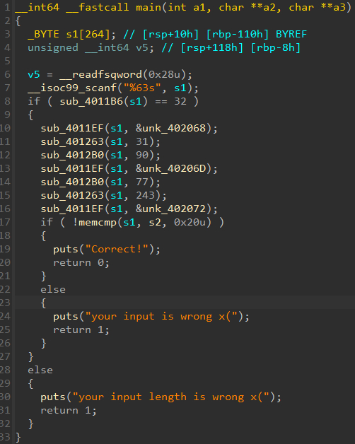
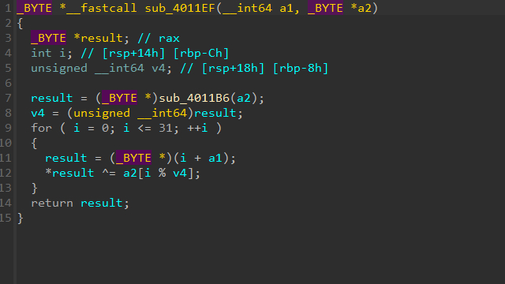
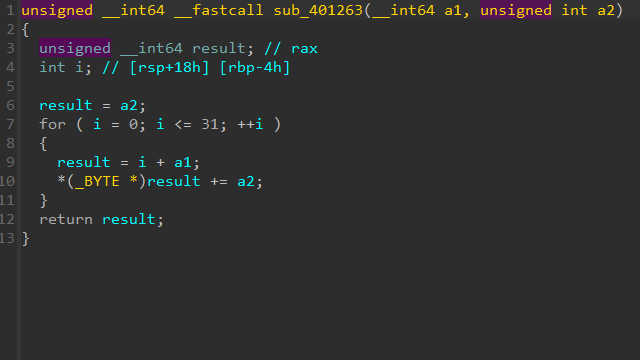
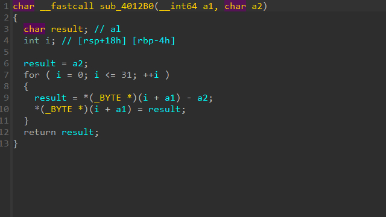
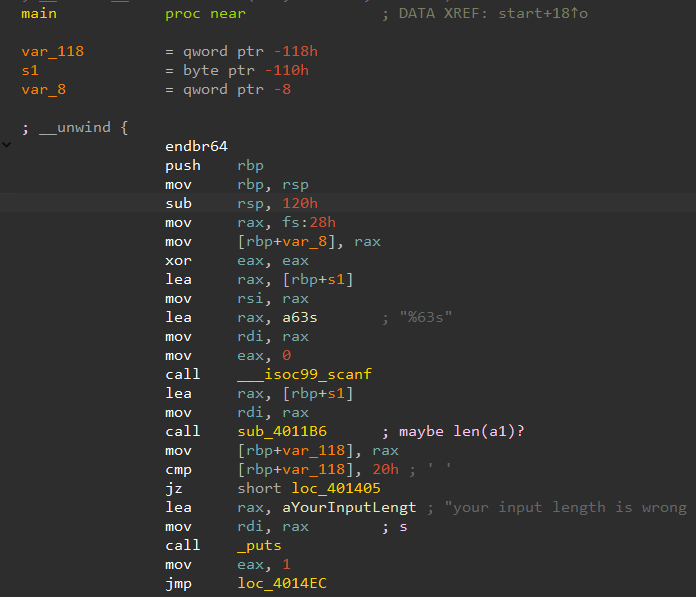
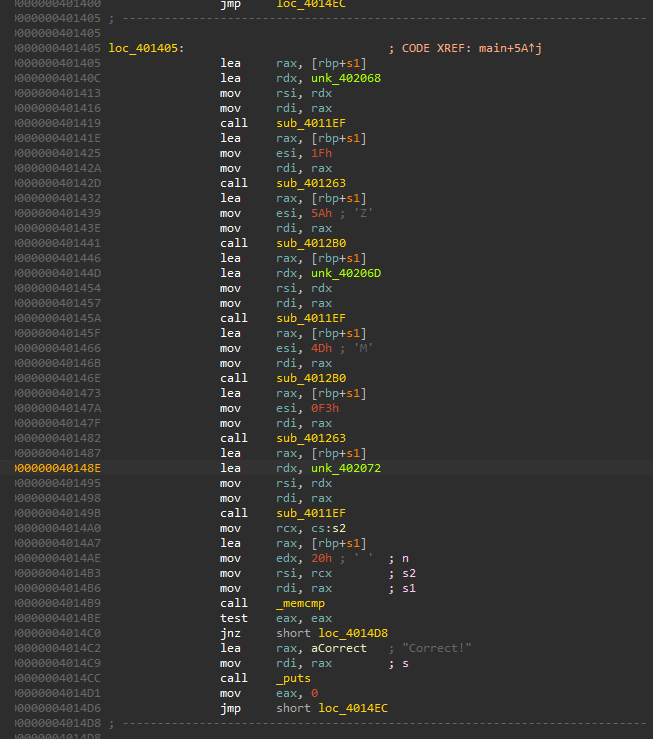

# [Simple-Crack-Me2]  

## 🔍 문제 설명 / Problem Description
- 문제 출처 / Source: https://dreamhack.io/wargame/challenges/668
- 요약 / Summary:
  - 간단한 문자열 비교를 통해 플래그를 찾는 리버싱 문제입니다.  
  - This is a simple reversing challenge based on string comparison.

## 🛠 사용 도구 및 환경 / Tools & Environment
- 사용한 도구 / Tools used: IDA Free 9.1

- 분석 환경 / Analysis environment: MS Windows 10

## 🧠 의사 코드 분석 / Pseudocode Analysis  
- 실행 포맷 / Executable format: ELF64 for x86-64 (Executable)

- 주요 함수 및 흐름 / Key functions & flow  
1. **Main Function**  
  
   사용자 입력을 받고 sub_4011B6(input) 이 32면  
   특정 암호화 과정을 거쳐서 테이블과 비교 후 correct를 출력하는 형태이다  

   그렇다면 sub_4011B6은 뭘까?  
  
2. **Sub_4011B6 (maybe len())**  
  
   처음 코드를 보고 당황했지만 입력 주소가 계속 증가하고  
   따로 카운트가 있는것을 보아하니 len 라는걸 유추할 수 있었다.  

3. **Sub_4011EF (Encrypt Function1)**  
  
   입력값이 특정 키 테이블과 XOR 암호화가 되는 간단한 연산  

4. **Sub_401263 (Encrypt Function2)**  
  
   입력값에 특정 값을 더하는 간단한 연산  

5. **Sub_4012B0 (Encrypt Function3)**   
  
   입력값에 특정 값을 빼는 간단한 연산  

을 통해서 암호화가 된다.  
단순 사칙연산과 XOR연산 뿐이기에 역연산을 구하는건 어렵지 않았다.  
 
## 🧠 어셈블리 분석 / Assembly Analysis  
1. **Main**  
  
   그래도 혹시나 의사코드와 어셈블리가 결이 다를 수 있기에 어셈블리와  
   대조하며 보았다.  

2. **loc_401405**    
  
   어쩌피 loc_401405로 분기가 넘어가지 않는다면 correct가 나오지 않기에 loc_401405로 바로 넘겼다.  
   여기 있는 함수 하나하나를 전부 설명하기에는 길어지니 적지는  
   않도록 하겠다.

## 🔓 풀이 과정 / Solution Steps  
1. **입력값 추론**      
   일단 위에서 말한대로 입력값의 길이가 32여야 하고  
   
2. **실패 이유**  
   나머지는 역연산을 이용하여 값을 추출하면 되지만 이상할정도로  
   값이 들어맞지 않자 결국 내가 export한 hex view에서  
   틀린 이유를 찾을 수 있었는데...  
   hex view의 널 종결까지 리스트에 추가시켜서  
   역연산을 실패한것이였다..  

3. **답안 코드**    
```
table = [ 0xF8 , 0xE0 , 0xE6 , 0x9E , 0x7F , 0x32 , 0x68 , 0x31 ,
            0x05 , 0xDC , 0xA1 , 0xAA , 0xAA , 0x09 , 0xB3 , 0xD8 ,
            0x41 , 0xF0 , 0x36 , 0x8C , 0xCE , 0xC7 , 0xAC , 0x66 ,
            0x91 , 0x4C , 0x32 , 0xFF , 0x05 , 0xE0 , 0xD9 , 0x91 ]

unk_402068 = [0xDE , 0xAD , 0xBE , 0xEF]
unk_40206D = [0xEF , 0xBE , 0xAD , 0xDE]
unk_402072 = [0x11 , 0x33 , 0x55 , 0x77 , 0x99 , 0xBB , 0xDD]

def sub_001(a1 , a2):
    v4 = len(a2)
    result = []
    for i in range(32):
        result.append((a1[i] ^ a2[i%v4])&0xFF)
    return result

def sub_002(a1 , a2):
    result = []
    for i in range(32):
        result.append((a1[i]-a2)&0xFF)
    return result 

def sub_003(a1 , a2):
    result = []
    for i in range(32):
        result.append((a1[i] + a2)&0xFF)
    return result

input = sub_001(table , unk_402072) 
input = sub_002(input , 243)
input = sub_003(input , 77)
input = sub_001(input , unk_40206D)
input = sub_003(input , 90)
input = sub_002(input , 31)
input = sub_001(input , unk_402068)

for i in range(len(input)):
    input[i] = chr(input[i])

print("DH{"+''.join(input)+"}")
```  

## ✅ 결과 / Result
-  

   (KR) 그래서 결과값은 성공!  을 적고 싶었으나 컴파일 과정을   거쳐야하므로 그냥 도출된 flag만 적어서 정답을 확인했었다.   

## 📝 기타 메모 / Notes
- (KR) 분석 중 삽질하거나 기록해두고 싶은 것들  
- (EN) Extra notes, pitfalls, or things to remember later

1. hex view 널 종결 꼭 확인하기!
