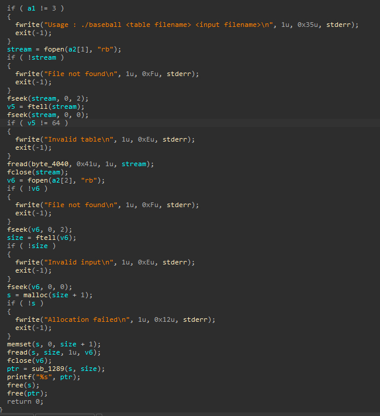
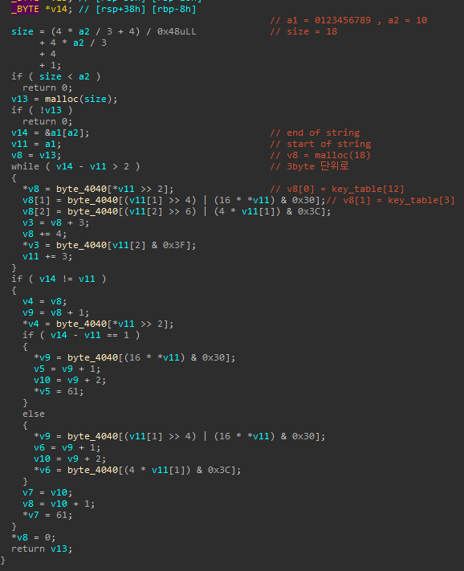
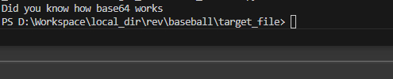

# [baseball]  

## 🔍 문제 설명 / Problem Description  
- 문제 출처 / Source: https://dreamhack.io/wargame/challenges/105  
- 요약 / Summary:  
  - base64로 인코딩 시키는 파일이 있고 인코딩 전/후 텍스트를 이용하여  
  - base64 custom table 을 추출하여 flag_out을 역으로 디코딩 하면 되는 문제입니다.  
  
## 🛠 사용 도구 및 환경 / Tools & Environment  
- 사용한 도구 / Tools used: IDA Free 9.1  
- 분석 환경 / Analysis environment: MS Windows 10  
- 실행 포맷 / Executable format: ELF64 for x86-64 (Shared Object)  

## 🧠 의사 코드 분석 / Pseudocode Analysis  
1. **Main Function**  
  
   여러 예외 처리들이 존재하고 눈 여겨 볼점은 v5 != 64 조건식인데  
   문제 제목의 baseball 도 그렇고 테이블의 길이를 검증할때에 64를 검사하는걸 보면  
   base64 인코딩일 확률이 높아보인다.  
   (여기서부터 base64는 익숙하니까 역연산 안 하려고 했었음)  
   추가로 ptr에 특정 함수를 거쳐 출력을 하는걸 보니 저 sub_1289가 인코딩 로직이 들어있는  
   함수라고 추측하였다.  

2. **Sub_1289**  
  
   주석은 진짜 base64 인코딩 과정인지 확인하기 위한 삽질이니 신경쓰지 말자  
   내가 아는 방식 보다 조금 더 저수준의 형태라 base64 인코딩인지 확인하기 어려웠으나  
   수기로 작성도 해보고 주석도 달면서 흐름을 따라가보니 base64 인코딩이라는걸
   확신할 수 있었다. 그런데 문제를 다루기 이전에 text_out의  

   > 7/OkZQIau/jou/R1by9acyjjutd0cUdlWshecQhkZUn1cUH1by9g4/9qNAn1byGaby9pbQSjWshgbUmqZAF+JtOBZUn1b8e1YoMPYoM1ny95ZAO+J/jaNAOB2vhrNLhVNDO0cshWNDIjbnrnZQhj4AM1S/Fmu/jou/GjN/n1bUm5JUFpNte1NyH1VA9yZUqLZQu13VR=

   를 일반 base64 decode 사이트에서 넣어 디코딩 해봤으나 text_in과 다르게 나왔기에  
   base64 table이 변형된 것도 알 수 있었다.  
   이러한 점들을 종합해 풀이자가 해야 할 일은 custom table을 복원하는것.  
  
## 🧠 어셈블리 분석 / Assembly Analysis  
   X  
   이번에는 base64 의 인코딩 방법을 알고 있었기에 가능한 어셈블리를  
   사용하기가 싫었다.

## 🔓 풀이 과정 / Solution Steps  
1. **입력값 추론**      
   X  
2. **실패 이유**  
   X  
3. **답안 코드**   

```   
import io

def extract(a1,a2):     ## 테이블을 추출하는 함수
    output_str = []     
    key_table = [0] * 65    ## 추출된 테이블을 담기 위한 공간 

    while(1):
        c = a1.read()   ## 인코딩 되기 이전의 텍스트를 읽어옴
        if not c:       ## EOF 면 멈춤
            break
        input_8bit = ''.join(format(byte,'08b') for byte in c)  ## 추출된 텍스트를 8bit형태로 나열
        input_6bit = [int(input_8bit[i:i+6],2) for i in range(0,len(input_8bit),6)] ## 8bit 형태로 된 비트를
                                                                ## 6bit 단위로 쪼갠 뒤 10진수로 바꿈
    while(1):
        c = a2.read(1)  ## 인코딩 이후의 텍스트를 읽어옴
        if not c:       ## EOF 면 멈춤
            break
        output_str.append(chr(c[0]))    ## 텍스트들을 문자로 변환해서 저장

    for i in range(0,len(input_6bit)):
        if(key_table[input_6bit[i]] == 0 ): ## 추출되지 않았다면
            key_table[input_6bit[i]] = output_str[i] ## 그 테이블 인덱스에 인코딩 이후의 문자를 넣어 테이블을 만듦
    return key_table

def flag_decode(a1,a2): ## 추출된 키 테이블을 가지고 플래그를 도출
    flag = []
    flag_decimal = []
    s = a1.read()       ## 인코딩 된 플래그를 읽어옴

    for i in range(0,len(s)):
        for j in range(0,len(a2)):
            if(chr(s[i]) == a2[j]): ## 인코딩 된 플래그의 문자와 키 테이블의 문자가 같다면 키 테이블의 인덱스를 
                flag_decimal.append(j) ## 10진수로 넣는다. 한 마디로 문자를 키 테이블의 10진수로 바꾸는 과정

    flag_6bit = ''.join(format(byte,'06b') for byte in flag_decimal) ## 바꿔진 값들을 6bit단위로 쪼개고
    flag_8bit = flag_6bit + '0' * 6                        ## 8의 배수로 맞춰줄 생각이였으나 의미는 없었다.

    for i in range(0,len(flag_8bit),8):                 ## 8bit 씩 끊어서
        byte_str = flag_8bit[i:i+8]
        byte_val = int(byte_str, 2)                     ## 10진수로 바꾸고
        flag.append(chr(byte_val))                      ## 문자로 변환하여
    
    print("".join(flag))                                ## 플래그 추출

if __name__ == '__main__' :
    with open('text_in.txt','rb') as str_input , open('text_out.txt','rb') as str_output:
        key_table = extract(str_input,str_output) ## 주어진 예시 입출력 텍스트를 가지고 테이블을 추출
    
    with open('flag_out.txt','rb') as flag_output:
        flag_decode(flag_output,key_table) ## 추출된 키 테이블을 갖고 flag 값을 도출
```  

## ✅ 결과 / Result
- 

## 📝 기타 메모 / Notes
- (KR) 분석 중 삽질하거나 기록해두고 싶은 것들  
- (EN) Extra notes, pitfalls, or things to remember later

- (1). 중간에 테이블 추출할때 중복 문자를 생각 안 하고 조건문 안 넣었다가   
      추출되는 테이블이 엉망진창으로 나왔는데 그것도 모르고 encode 코드 짜고   
      왜 안 되지? 하다 30분 날리고 풀었음
