# ★4 Times
>https://dreamhack.io/wargame/challenges/247  

## 0. 문제 설명
#### Description
    드림이는 2030년에 열리는 드림 콘서트의 티켓을 등록하고 싶지만, 티켓 등록 프로그램은 아직 시간이 되지 않았다고 합니다. 드림이의 빠른 티켓 등록을 위해 프로그램을 분석하고 티켓 등록 키를 알아내주세요!

    올바른 티켓 등록 키에 DH{}를 감싸서 인증해주세요.  

#### 구성 요소 확인
    1. times (14,528KB)

## 1. 범위 및 목표
- **목표**  
    2030년의 올바른 티켓 등록 키를 구하기  
<br><br>

- **우선 순위**  
    1. times  
<br><br>  

- **분석 범위**  
    1. times  
<br><br>  

## 2. 1차 정적 분석  
- **기본 정보**  
    1. Format : ELF64 for x86-64  
    2. Interpreter : '/lib64/ld-linux-x86-64.so.2'  
    3. Needed Library : 'libc.so.6'  
    4. used tools : IDA Free 9.1 , GNU gdb (Debian 16.2-8) 16.2  
<br><br>

- **Main**
    1. *argc = 2* 일때 올바른 등록 키 인지 확인  
        <br>

    2. 올바른 등록키의 길이 *0x29u* 확인  

        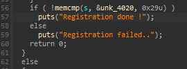  
        <br>  

    3. 동일한 XOR 연산의 반복 구조 확인  
      
        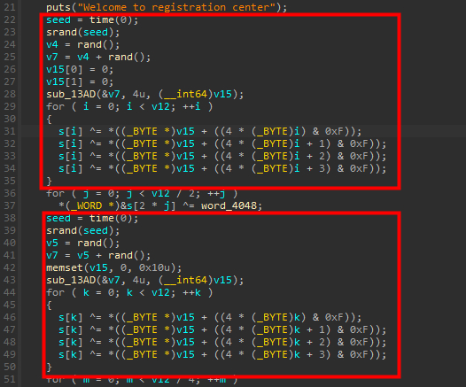  
        <br>  

- ### 2-1. 실행
- **첫번째 결과**  
    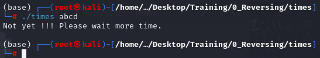  

    메인에서 나올 수 있는 분기가 아니므로 메인 함수 이전에  
    다른 영향을 줄 수 있는 요소를 확인했다.  
    <br><br>

## 3. 2차 정적 분석  
- ### 3-1. entry point  
    이상 없음  
    <br>  

- ### 3-2. .init section  

    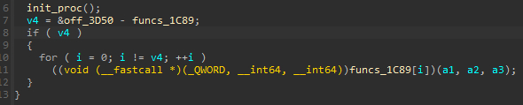  

    v4 = &off_3D50 - funcs_1C89 = 0x3D50 - 0x3D40  
    &nbsp; = 0x10  
    <br><br>  

    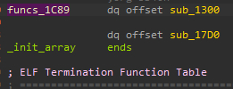  
    (1) sub_1300 -> sub_1280 -> return 0;  

    (2) sub_17D0  
    ->  
    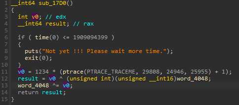  
    첫 실행때 나온 분기를 찾아냈다.  
    *현재 시간 값을 받아오고 이 시간 값이 2030년을 넘지 않을시 정해진 문자열을  
    출력하고 프로그램을 종료한다.*  
    <br>

    이후에 간단한 안티 디버깅 로직이 들어간다.  
    ptrace(TRACEME) 는 부모 프로세스가 나를 추적할 수 있도록 허용 하는 것인데  
    디버깅을 시작하면 지정된 프로세스에 attach하게 되고  
    복수의 부모 프로세스를 만들기에 실패 후 -1을 반환하게 된다.  
    <br>

    이러면 디버깅 상태와 일반적인 실행 상태가 다를 수 있기에  
    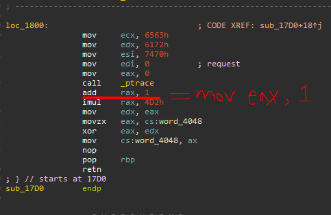  
    어셈블리를 패치하여 상시 같은 값으로 유지 될 수 있게 하였다.  
    <br><br>  

- ### 3-3. .main section  
    그렇다면 현재까지 알아낸 정보들을 취합해보자.  
    (1) argc = 2  

    (2) len(argv[1]) = 0x29  

    (3) 시간은 2030년 이후    

    (4) 그런데 현재 시간을 호출하는 함수가 .init section 만 있는게 아니라  
    .main section 에서 2 회 호출하기에 난수 시드 값이 매번 바뀌는 문제점이 있다.  
    하지만 time 함수를 건드릴 수 는 없기 떄문에 동적 분석으로 들어가 매 time 호출시 마다  
    2030 년 이후의 시간 값을 넣어 주어야 한다.  

    (5) main -> sub_13AD -> sub_1309 or sub_135C 내부까지 모두 확인 하였을때  
    따로 티켓 등록 키에 영향을 주는 계산은 없었으므로 결국 sub_13AD 에서 처리되는  
    v15 만이 등록 키에 영향을 주는 변수인데...  
    위에서 동일한 구조가 2회 반복된 다고 했었다. 이는 시드값이 동일할 경우 완전히  
    똑같은 xor 연산 2회 이기에 이 반복문의 xor 연산은 생략할 수 있으므로  
    sub_13AD 와 그 내부의 함수들은 굳이 계산 할 필요가 없었던 것이다.  
    ~~그래도 확인 한 번은 해보았지만...~~  

    (6) (5)의 분석에 의해 main의 역연산에 필요한 계산은 결국  
    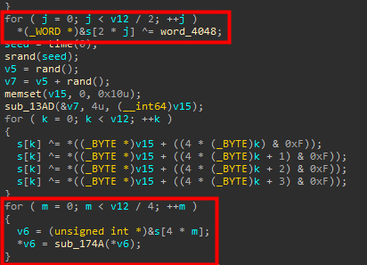  
    저 두 부분이었다.  
    <br>

- ### 3-4. sub_174A  
    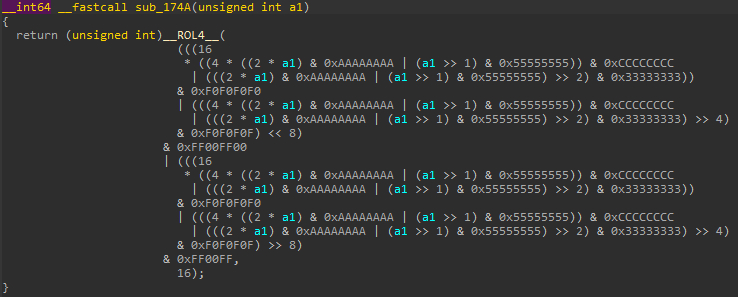  
    첫 번째 인수때문에 복잡해 보이지만 어쩌피 좌측 회전 시프트이다.  
    ROL(x,n) <-> ROR(x,n) 이기에 첫 번째 인수를 그대로 가져와서  
    시프트 연산을 처리하면 될 것이다.  
    <br>  

## 4. 익스플로잇 코드 작성  
- **흐름**  
    main -> xor loop -> ROL4  
    이므로 역연산 코드 흐름은  

    ROL4 -> xor loop  
    로 작성하면 되겠다.

    그렇게 작성을 했는데...  
    생각해보니 xor loop가 역연산 코드에 들어갈 필요가 없는 이유가  
    .init section -> sub_17D0 에서 word_4048 이 0이 되어버리기 때문이다.  

    이 사실을 모르고 왜 값이 계속 다르지하며 삽질을 했었다.  
    <br>  

- ### **4-1** 최종 익스 코드
    ```  
    ## times exploit

    def ROR(num,count,bits=32):
        num &= (1<<bits)-1
        return ((num >> count) | (num << (bits - count))) & ((1<<bits) - 1)

    def pack4(b0,b1,b2,b3):
        return b0 | (b1 << 8) | (b2 << 16) | (b3 << 24)

    def sub_174A(a1):
        return ROR(
        (((16 * ( (4 * ( (2 * a1 ) & 0xAAAAAAAA | (a1 >> 1) & 0x55555555 ) ) & 0xCCCCCCCC | ( ( (2 * a1) & 0xAAAAAAAA | (a1 >> 1) & 0x55555555 ) >> 2 ) & 0x33333333 ))
        & 0xF0F0F0F0 | (((4 * ((2 * a1) & 0xAAAAAAAA | (a1 >> 1) & 0x55555555)) & 0xCCCCCCCC | (((2 * a1) & 0xAAAAAAAA | (a1 >> 1) & 0x55555555) >> 2) & 0x33333333) >> 4) & 0xF0F0F0F) << 8
        )
        & 0xFF00FF00 | (((16 * ((4 * ((2 * a1) & 0xAAAAAAAA | (a1 >> 1) & 0x55555555)) & 0xCCCCCCCC | (((2 * a1) & 0xAAAAAAAA | (a1 >> 1) & 0x55555555) >> 2) & 0x33333333))
        & 0xF0F0F0F0 | (((4 * ((2 * a1) & 0xAAAAAAAA | (a1 >> 1) & 0x55555555)) & 0xCCCCCCCC | (((2 * a1) & 0xAAAAAAAA | (a1 >> 1) & 0x55555555) >> 2) & 0x33333333) >> 4
        ) & 0xF0F0F0F) >> 8) & 0xFF00FF , 16)

    table = [0x66 , 0x0C , 0x4C , 0x86 , 0xA6 , 0x2C , 0x1C , 0x9C , 
            0x1C , 0x66 , 0x1C , 0x2C , 0x9C , 0x6C , 0xA6 , 0xCC ,
            0xA6 , 0x6C , 0x6C , 0xAC , 0xA6 , 0xA6 , 0x86 , 0x4C ,
            0x2C , 0x46 , 0xEC , 0x8C , 0xEC , 0x46 , 0x8C , 0x9C ,
            0x4C , 0xEC , 0xC6 , 0x66 , 0x4C , 0x46 , 0x86 , 0x4C ,
            0xD2 , 0x04 , 0x00 , 0x00 ]

    res = []
    new_res = []
    dec = []
    fin = []

    for i in range(0,len(table),4):
        chunk = pack4(table[i],table[i+1],table[i+2],table[i+3])
        res.append(sub_174A(chunk))
        
    for i in range(len(res)):
        res[i] = hex(res[i])

    for i in res:
        num = int(i , 16)
        new_res.append(num & 0xffff)
        new_res.append((num>>16) & 0xffff)

    '''
    for i in range(len(new_res)):
        new_res[i] = ( new_res[i] ^ 1234 )
    '''
        
    for i in range(len(new_res)):
        new_res[i] = hex(new_res[i]) 

    for i in new_res:
        num = int(i , 16)
        dec.append(num & 0xff)
        dec.append((num>>8) & 0xff)

    for i in range(len(dec)):
        dec[i] = chr(dec[i])
        
    print(''.join(dec))
    ```
    <br><br>

## 5. 동적 분석 
- ### GDB로 동적 분석
    ```
    gdb --args ./times flag
    ```
    로 gdb를 열고 time 함수에 bp를 잡은 후에  
    <br>  

    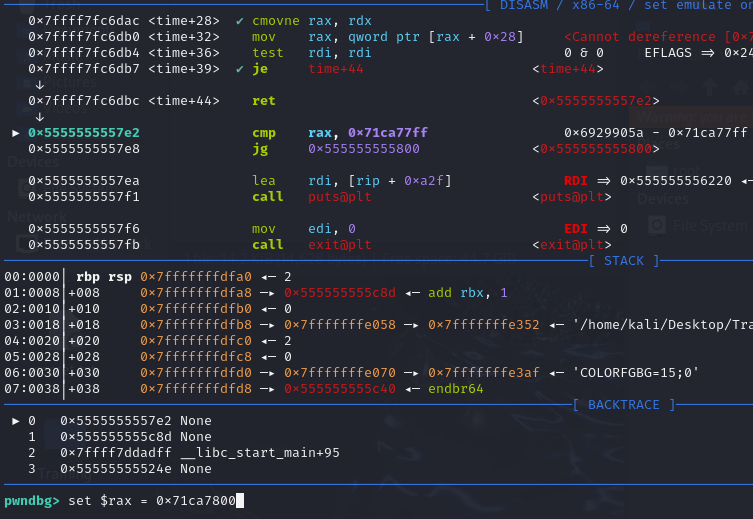  
    sub_17D0 의 시간 값 고정  
    <br>  

    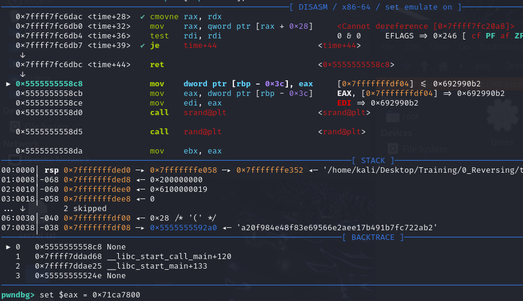  
    main 의 첫 번째 시간 값 고정  
    <br>  

    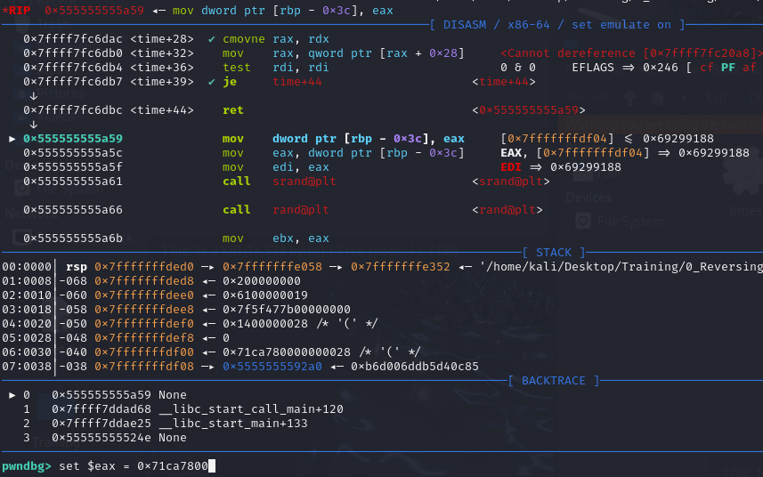  
    main 의 두 번째 시간 값 고정  
    <br><br>  


## 6. 확인  
- ### 최종 확인  
    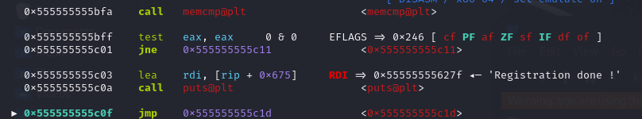  
    " Registration done ! "