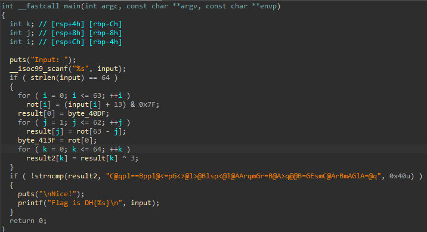
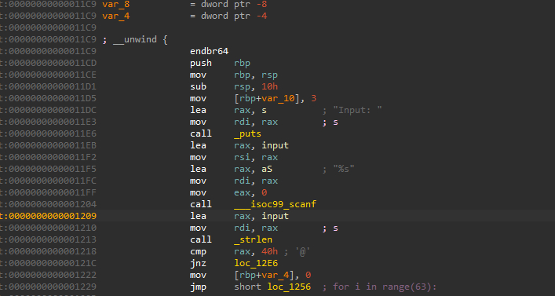
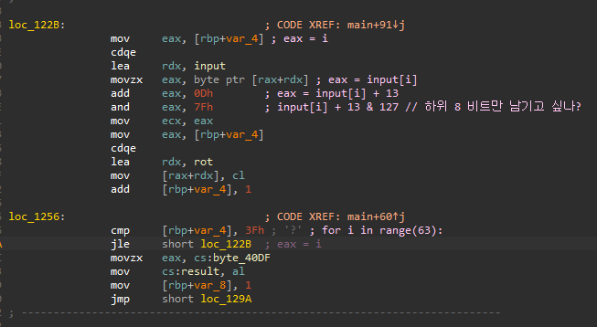
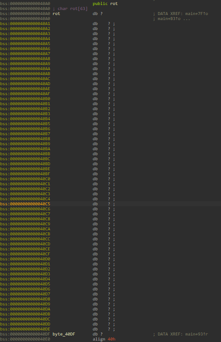
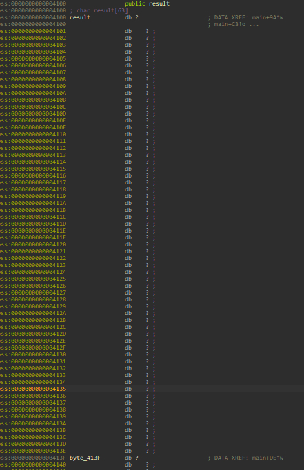
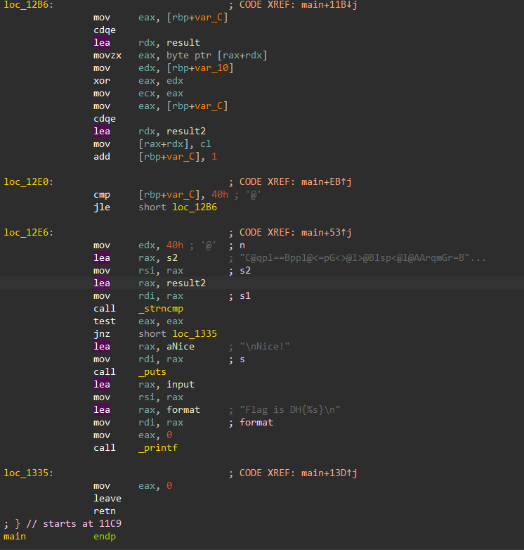

# [r-xor-t]  

## 🔍 문제 설명 / Problem Description
- 문제 출처 / Source: https://dreamhack.io/wargame/challenges/901
- 요약 / Summary:
  - 간단한 문자열 비교를 통해 플래그를 찾는 리버싱 문제입니다.  
  - This is a simple reversing challenge based on string comparison.

## 🛠 사용 도구 및 환경 / Tools & Environment
- 사용한 도구 / Tools used: IDA Free 9.1

- 분석 환경 / Analysis environment: MS Windows 10

## 🧠 의사 코드 분석 / Pseudocode Analysis  
- 실행 포맷 / Executable format: ELF64 for x86-64 (Shared Object)

- 주요 함수 및 흐름 / Key functions & flow  
1. **Main Function**  
  
   Main 함수에 모든 로직이 몰아져 있는걸 확인했다.  
   (1). 입력 문자열의 길이가 64  
   (2). 간단한 연산
  
## 🧠 어셈블리 분석 / Assembly Analysis  
1. **Main**  
  
   그래도 혹시나 의사코드와 어셈블리가 결이 다를 수 있기에  어셈블리와 대조하며 보았다.  

   대부분의 문자열 포맷 형태의 문제와 유사하지만 특이하게  
   rbp+var_10 에 3을 넣는 부분이 있었다.  

   아마 의사코드에서 본 xor 3 연산의 3이 아닐까 추측해본다.    

2. **1st loop**    
  
   첫번째 루프는 의사코드와 큰 차이점은 없었다.  
   rot에 연산결과가 정방향으로 들어간다는 것을 참고해두자  
   그리고 따로 result 첫 부분에 rot의 끝 부분이 들어갔다.  

3. **2nd loop**  
  
   두번째 루프는 rot에 들어간 결과가 역방향으로 result에 들어갔다.   
   그리고 따로 result 끝 부분에 rot의 첫 부분이 들어갔다.  
   이로 인해 알 수 있는점은 .reverse()와 유사한 연산을 처리한걸로 보인다.  
   위의 사항은  

  

  

   직접 찾아서 레이블을 확인 해보니 알 수 있었다.  

4. **3rd loop~end**  
  
   역시나 의사코드와 동일하게 xor 연산을 시행하는 모습  
   rbp+var_10 은 메인에서 선언한 3이 들어갔다.  

## 🔓 풀이 과정 / Solution Steps  
1. **입력값 추론**      
   역연산 과정은 xor연산은 다시 한번 하면 역연산이니 xor 3 한번 하면 되고  
   연산 결과를 한번 거꾸로 뒤집어서 정방향으로 맞춘 뒤  
   합연산을 차연산으로 바꾸고 비트를 가려내면 나올거라고 추측할 수 있었다.  
   
2. **실패 이유**  
   X  
3. **답안 코드**    
```  
table = [0x43 , 0x40 , 0x71 , 0x70 , 0x6C , 0x3D , 0x3D , 0x42 , 0x70 , 0x70 , 0x6C , 0x40 , 0x3C , 0x3D , 0x70 , 0x47 , 
        0x3C , 0x3E , 0x40 , 0x6C , 0x3E , 0x40 , 0x42 , 0x6C , 0x73 , 0x70 , 0x3C , 0x40 , 0x6C , 0x40 , 0x41 , 0x41 , 
        0x72 , 0x71 , 0x6D , 0x47 , 0x72 , 0x3D , 0x42 , 0x40 , 0x41 , 0x3E , 0x71 , 0x40 , 0x40 , 0x42 , 0x3D , 0x47 , 
        0x45 , 0x73 , 0x6D , 0x43 , 0x40 , 0x41 , 0x72 , 0x42 , 0x6D , 0x41 , 0x47 , 0x6C , 0x41 , 0x3D , 0x40 , 0x71]

result = [0] * (len(table))
reversed_result = [0] * (len(table))

for i in range(len(table)):
    result[i] = table[i] ^ 3 & 0x7F

reversed_result = result[::-1]

for i in range(len(table)):
    reversed_result[i] = ( reversed_result[i] - 13 ) & 0x7F
    reversed_result[i] = chr(reversed_result[i])

print("DH{"+''.join(reversed_result)+"}")
```  
## ✅ 결과 / Result
-  

   (KR) 그래서 결과값은 성공!  을 적고 싶었으나 컴파일 과정을   거쳐야하므로 그냥 도출된 flag만 적어서 정답을 확인했었다.   

## 📝 기타 메모 / Notes
- (KR) 분석 중 삽질하거나 기록해두고 싶은 것들  
- (EN) Extra notes, pitfalls, or things to remember later

