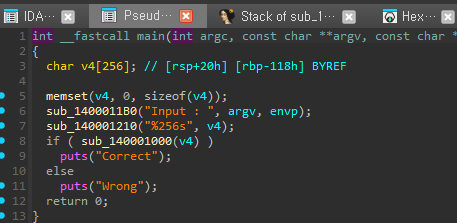
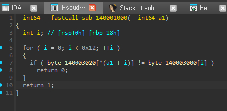
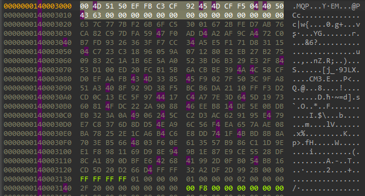
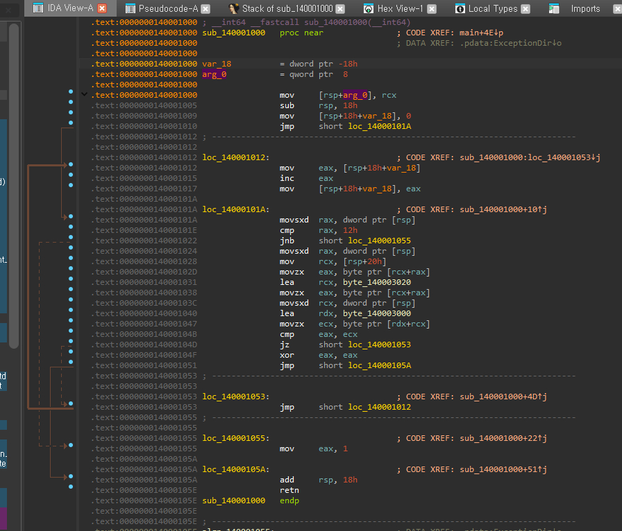
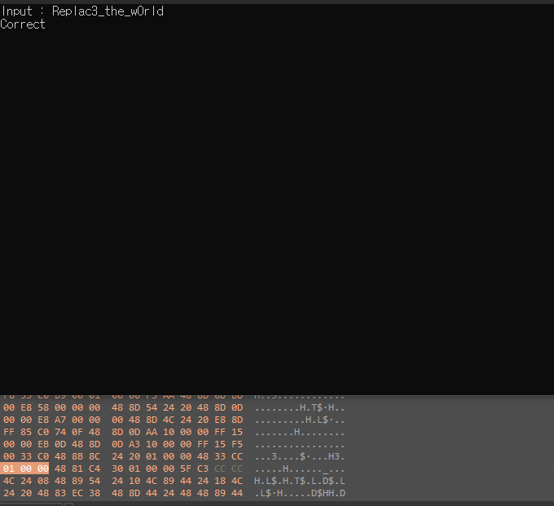

# [rev-basic-06]

## 🔍 문제 설명 / Problem Description
- 문제 출처 / Source: https://dreamhack.io/wargame/challenges/20
- 요약 / Summary:
  - 간단한 문자열 비교를 통해 플래그를 찾는 리버싱 문제입니다.  
  - This is a simple reversing challenge based on string comparison.

## 🛠 사용 도구 및 환경 / Tools & Environment
- 사용한 도구 / Tools used: IDA Free 9.1

- 분석 환경 / Analysis environment: MS Windows 10

## 🧠 분석 / Analysis
- 실행 포맷 / Executable format: Portable executable for AMD64 (PE)

- 주요 함수 및 흐름 / Key functions & flow

1. 문자를 입력 / Input string
2. 입력값 검증 / Verify input data
3. 분기별 출력 / Output divergence

- 의심 지점 / Suspicious parts
X

- 디버깅 관찰 / Observations during debugging
= 풀이 과정 / = Solution Steps

## 🔓 풀이 과정 / Solution Steps
1. (KR) 의사코드로 디컴파일 후 분석  
   (EN) After decompiling the assembly code into pseudocode, I analyzed it

   
   (KR) 의사코드 중 입력값을 검증하는 부분을 알아야 플래그를 알아낼 수 있기에 가장 먼저 보았다.  
   (EN) I focused first on the input validation part of the pseudocode since understanding it was key to retrieving the flag.  

2. (KR) 입력값 검증 테이블 분석  
   (EN) Input Validation Table Analysis  

     

   (KR) 테이블 표를 보고 기겁을 했으나 결국 byte_140003000이랑
   byte_140003020 이랑 같은 부분을 찾으면 되겠구나 싶었다.  
   (EN) I was horrified when I saw the table, but then I realized that all I had to do was find the matching parts between byte_140003000 and byte_140003020.  


3. (KR) 어셈블리와 비교하여 분석  
   (EN) Analysis and comparison of pseudocode and assembly

   
   (KR) 보아하니 별 다른 문제는 없는 모양  
   (EN) From the looks of it, there didn’t seem to be any unexpected behavior or hidden logic.  

4. (KR) 키/플래그 추출  
   (EN) Extract key/flag

   (KR) 그래서 단순히 의사코드만 보고 스크립트를 짰는데...  
   (EN) So, I wrote the script based purely on the pseudocode...  
```
A = [ 0x00 , 0x4D , 0x51 , 0x50 , 0xEF , 0xFB , 0xC3 , 0xCF ,
    0x92 , 0x45 , 0x4D , 0xCF , 0xF5 , 0x04 , 0x40 , 0x50 ,
    0x43 , 0x63 , 0x00 , 0x00 , 0x00 , 0x00 , 0x00 , 0x00 ,
    0x00 , 0x00 , 0x00 , 0x00 , 0x00 , 0x00 , 0x00 , 0x00 ]

B = [ 0x63 , 0x7C , 0x77 , 0x7B , 0xF2 , 0x6B , 0x6F , 0xC5 , # ~7
    0x30 , 0x01 , 0x67 , 0x2B , 0xFE , 0xD7 , 0xAB , 0x76 , # ~15
    0xCA , 0x82 , 0xC9 , 0x7D , 0xFA , 0x59 , 0x47 , 0xF0 , # ~23
    0xAD , 0xD4 , 0xA2 , 0xAF , 0x9C , 0xA4 , 0x72 , 0xC0 , # ~31
    0xB7 , 0xFD , 0x93 , 0x26 , 0x36 , 0x3F , 0xF7 , 0xCC , # ~39
    0x34 , 0xA5 , 0xE5 , 0xF1 , 0x71 , 0xD8 , 0x31 , 0x15 , # ~47
    0x04 , 0xC7 , 0x23 , 0xC3 , 0x18 , 0x96 , 0x05 , 0x9A , # ~53
    0x07 , 0x12 , 0x80 , 0xE2 , 0xEB , 0x27 , 0xB2 , 0x75 , # ~62
    0x09 , 0x83 , 0x2C , 0x1A , 0x1B , 0x6E , 0x5A , 0xA0 , # ~71
    0x52 , 0x3B , 0xD6 , 0xB3 , 0x29 , 0xE3 , 0x2F , 0x84 , # ~79
    0x53 , 0xD1 , 0x00 , 0xED , 0x20 , 0xFC , 0xB1 , 0x5B , # ~87
    0x6A , 0xCB , 0xBE , 0x39 , 0x4A , 0x4C , 0x58 , 0xCF , # ~95
    0xD0 , 0xEF , 0xAA , 0xFB , 0x43 , 0x4D , 0x33 , 0x85 , # ~103
    0x45 , 0xF9 , 0x02 , 0x7F , 0x50 , 0x3C , 0x9F , 0xA8 , # ~111
    0x51 , 0xA3 , 0x40 , 0x8F , 0x92 , 0x9D , 0x38 , 0xF5 ,
    0xBC , 0xB6 , 0xDA , 0x21 , 0x10 , 0xFF , 0xF3 , 0xD2 ,
    0xCD , 0x0C , 0x13 , 0xEC , 0x5F , 0x97 , 0x44 , 0x17 ,
    0xC4 , 0xA7 , 0x7E , 0x3D , 0x64 , 0x5D , 0x19 , 0x73 ,
    0x60 , 0x81 , 0x4F , 0xDC , 0x22 , 0x2A , 0x90 , 0x88 ,
    0x46 , 0xEE , 0xB8 , 0x14 , 0xDE , 0x5E , 0x0B , 0xDB ,
    0xE0 , 0x32 , 0x3A , 0x0A , 0x49 , 0x06 , 0x24 , 0x5C ,
    0xC2 , 0xD3 , 0xAC , 0x62 , 0x91 , 0x95 , 0xE4 , 0x79 ,
    0xE7 , 0xC8 , 0x37 , 0x6D , 0x8D , 0xD5 , 0x4E , 0xA9 ,
    0x6C , 0x56 , 0xF4 , 0xEA , 0x65 , 0x7A , 0xAE , 0x08 ,
    0xBA , 0x78 , 0x25 , 0x2E , 0x1C , 0xA6 , 0xB4 , 0xC6 ,
    0xE8 , 0xDD , 0x74 , 0x1F , 0x4B , 0xBD , 0x8B , 0x8A ,
    0x70 , 0x3E , 0xB5 , 0x66 , 0x48 , 0x03 , 0xF6 , 0x0E ,
    0x61 , 0x35 , 0x57 , 0xB9 , 0x86 , 0xC1 , 0x1D , 0x9E ,
    0xE1 , 0xF8 , 0x98 , 0x11 , 0x69 , 0xD9 , 0x8E , 0x94 ,
    0x9B , 0x1E , 0x87 , 0xE9 , 0xCE , 0x55 , 0x28 , 0xDF ,
    0x8C , 0xA1 , 0x89 , 0x0D , 0xBF , 0xE6 , 0x42 , 0x68 ,
    0x41 , 0x99 , 0x2D , 0x0F , 0xB0 , 0x54 , 0xBB , 0x16 ]

result = []

for i in range(0,17):
    for j in range(0,len(B)-i):
        if(A[i] == B[j]):
            result.append(chr(j-i))
            break
    
print("DH{"+ ''.join(result) +"}")
```

    (KR) 답이 아니었다...? 분명 의사코드를 정확히 스크립트로 짜냈는데?   
    (EN) But... it wasn't the answer? I had written the script based on the pseudocode perfectly, but it didn't work.  

    (KR) 하고 고민하고 조금 생각해본결과 어셈블리를 다시 보니 의사코드가 어셈블리와 다르게 나왔다는걸 찾았다.  
    (EN) After a bit of thinking and reviewing, I realized that when I looked at the assembly again, the pseudocode had a condition involving an array parameter that wasn’t present in the assembly.  

```
A = [ 0x00 , 0x4D , 0x51 , 0x50 , 0xEF , 0xFB , 0xC3 , 0xCF ,
    0x92 , 0x45 , 0x4D , 0xCF , 0xF5 , 0x04 , 0x40 , 0x50 ,
    0x43 , 0x63 , 0x00 , 0x00 , 0x00 , 0x00 , 0x00 , 0x00 ,
    0x00 , 0x00 , 0x00 , 0x00 , 0x00 , 0x00 , 0x00 , 0x00 ]

B = [ 0x63 , 0x7C , 0x77 , 0x7B , 0xF2 , 0x6B , 0x6F , 0xC5 , # ~7
    0x30 , 0x01 , 0x67 , 0x2B , 0xFE , 0xD7 , 0xAB , 0x76 , # ~15
    0xCA , 0x82 , 0xC9 , 0x7D , 0xFA , 0x59 , 0x47 , 0xF0 , # ~23
    0xAD , 0xD4 , 0xA2 , 0xAF , 0x9C , 0xA4 , 0x72 , 0xC0 , # ~31
    0xB7 , 0xFD , 0x93 , 0x26 , 0x36 , 0x3F , 0xF7 , 0xCC , # ~39
    0x34 , 0xA5 , 0xE5 , 0xF1 , 0x71 , 0xD8 , 0x31 , 0x15 , # ~47
    0x04 , 0xC7 , 0x23 , 0xC3 , 0x18 , 0x96 , 0x05 , 0x9A , # ~53
    0x07 , 0x12 , 0x80 , 0xE2 , 0xEB , 0x27 , 0xB2 , 0x75 , # ~62
    0x09 , 0x83 , 0x2C , 0x1A , 0x1B , 0x6E , 0x5A , 0xA0 , # ~71
    0x52 , 0x3B , 0xD6 , 0xB3 , 0x29 , 0xE3 , 0x2F , 0x84 , # ~79
    0x53 , 0xD1 , 0x00 , 0xED , 0x20 , 0xFC , 0xB1 , 0x5B , # ~87
    0x6A , 0xCB , 0xBE , 0x39 , 0x4A , 0x4C , 0x58 , 0xCF , # ~95
    0xD0 , 0xEF , 0xAA , 0xFB , 0x43 , 0x4D , 0x33 , 0x85 , # ~103
    0x45 , 0xF9 , 0x02 , 0x7F , 0x50 , 0x3C , 0x9F , 0xA8 , # ~111
    0x51 , 0xA3 , 0x40 , 0x8F , 0x92 , 0x9D , 0x38 , 0xF5 ,
    0xBC , 0xB6 , 0xDA , 0x21 , 0x10 , 0xFF , 0xF3 , 0xD2 ,
    0xCD , 0x0C , 0x13 , 0xEC , 0x5F , 0x97 , 0x44 , 0x17 ,
    0xC4 , 0xA7 , 0x7E , 0x3D , 0x64 , 0x5D , 0x19 , 0x73 ,
    0x60 , 0x81 , 0x4F , 0xDC , 0x22 , 0x2A , 0x90 , 0x88 ,
    0x46 , 0xEE , 0xB8 , 0x14 , 0xDE , 0x5E , 0x0B , 0xDB ,
    0xE0 , 0x32 , 0x3A , 0x0A , 0x49 , 0x06 , 0x24 , 0x5C ,
    0xC2 , 0xD3 , 0xAC , 0x62 , 0x91 , 0x95 , 0xE4 , 0x79 ,
    0xE7 , 0xC8 , 0x37 , 0x6D , 0x8D , 0xD5 , 0x4E , 0xA9 ,
    0x6C , 0x56 , 0xF4 , 0xEA , 0x65 , 0x7A , 0xAE , 0x08 ,
    0xBA , 0x78 , 0x25 , 0x2E , 0x1C , 0xA6 , 0xB4 , 0xC6 ,
    0xE8 , 0xDD , 0x74 , 0x1F , 0x4B , 0xBD , 0x8B , 0x8A ,
    0x70 , 0x3E , 0xB5 , 0x66 , 0x48 , 0x03 , 0xF6 , 0x0E ,
    0x61 , 0x35 , 0x57 , 0xB9 , 0x86 , 0xC1 , 0x1D , 0x9E ,
    0xE1 , 0xF8 , 0x98 , 0x11 , 0x69 , 0xD9 , 0x8E , 0x94 ,
    0x9B , 0x1E , 0x87 , 0xE9 , 0xCE , 0x55 , 0x28 , 0xDF ,
    0x8C , 0xA1 , 0x89 , 0x0D , 0xBF , 0xE6 , 0x42 , 0x68 ,
    0x41 , 0x99 , 0x2D , 0x0F , 0xB0 , 0x54 , 0xBB , 0x16 ]

result = []

for i in range(0,17):
    for j in range(0,len(B)-i):
        if(A[i] == B[j]):
            result.append(chr(j))
            break
    
print("DH{"+ ''.join(result) +"}")
```
    (KR) 의사코드에서는 배열 인자까지 조건문에 더했는데 어셈블리에는 그런 항목이 없었다... 어셈블리를 대충 훑어본 나의 잘못으로 삽질을 하게 되었던 것    
    (EN) It was my mistake to skim through the assembly, which led me to waste time.  


## ✅ 결과 / Result
- 

## 📝 기타 메모 / Notes
- (KR) 분석 중 삽질하거나 기록해두고 싶은 것들  
- (EN) Extra notes, pitfalls, or things to remember later

1. (KR) 항상 의사코드는 의심하자  
   (EN) Always question the pseudocode.  