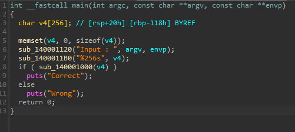
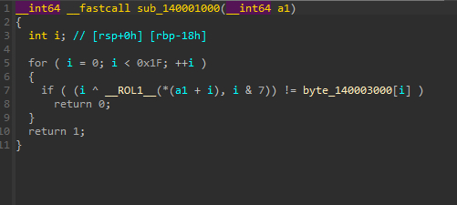
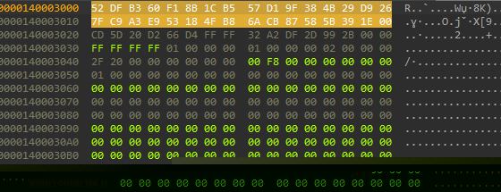
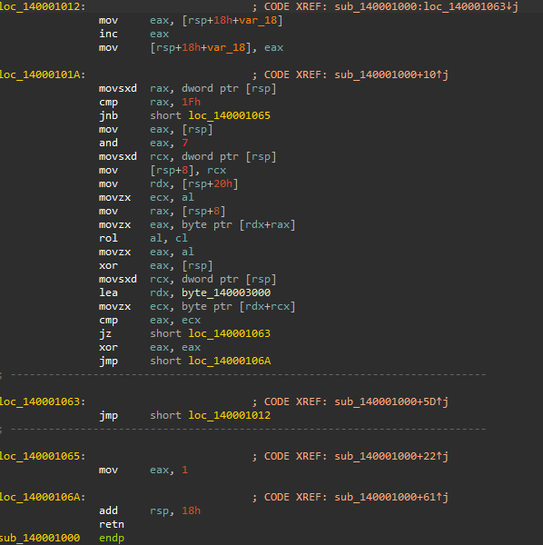
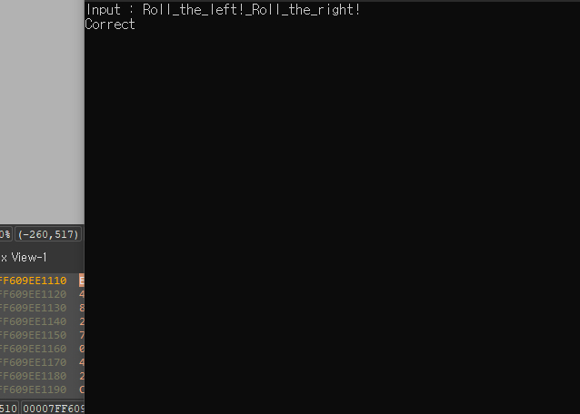

# [rev-basic-07]

## 🔍 문제 설명 / Problem Description
- 문제 출처 / Source: https://dreamhack.io/wargame/challenges/21
- 요약 / Summary:
  - 간단한 문자열 비교를 통해 플래그를 찾는 리버싱 문제입니다.  
  - This is a simple reversing challenge based on string comparison.

## 🛠 사용 도구 및 환경 / Tools & Environment
- 사용한 도구 / Tools used: IDA Free 9.1

- 분석 환경 / Analysis environment: MS Windows 10

## 🧠 분석 / Analysis
- 실행 포맷 / Executable format: Portable executable for AMD64 (PE)

- 주요 함수 및 흐름 / Key functions & flow  
  
1. 문자를 입력 / Input string
2. 입력값 검증 / Verify input data
3. 분기별 출력 / Output divergence

- 의심 지점 / Suspicious parts
X

- 디버깅 관찰 / Observations during debugging
= 풀이 과정 / = Solution Steps

## 🔓 풀이 과정 / Solution Steps
1. (KR) 의사코드로 디컴파일 후 분석  
   (EN) After decompiling the assembly code into pseudocode, I analyzed it

   
   (KR) 의사코드 중 입력값을 검증하는 부분을 알아야 플래그를 알아낼 수 있기에 가장 먼저 보았다.  
   (EN) I focused first on the input validation part of the pseudocode since understanding it was key to retrieving the flag.  

2. (KR) 입력값 검증 테이블 분석  
   (EN) Input Validation Table Analysis  

     

   (KR) 뭐 테이블은 길지도 짧지도 않은 모습  
   (EN) The table appears to be of moderate length—not particularly long or short.  


3. (KR) 어셈블리와 비교하여 분석  
   (EN) Analysis and comparison of pseudocode and assembly

   
   (KR) 보아하니 별 다른 문제는 없는 모양  
   (EN) From the looks of it, there didn’t seem to be any unexpected behavior or hidden logic.  

   (KR) 그래서 그냥 역연산을 하기로 마음을 먹었다. 의사코드 내용이랑 어셈블리랑 큰 차이가 없는것도 같고  
        0~7번 회전 한다는것도 아마 16진수 문자이기에 8bit를 사용하니까 7번으로 제한을 둔거 같았다.  
        xor 연산은 역연산 할떄 xor 한번 해주면 되는거고   
        회전 시프트를 좌측으로 0~7번 시키는거니까 나는 우측으로 똑같이 돌려주면 원하는 결과값을 찾을 수 있으리라.  
   (EN) So I decided to proceed with reversing it directly, since the pseudocode and assembly didn’t seem significantly different.  
    The rotation range of 0 to 7 likely comes from the fact that hexadecimal characters use 8 bits, limiting the shift to 7 positions.  
    As for the XOR operation, reversing it just requires applying XOR once again.  
    Since the shift rotates left by 0 to 7 positions, I assumed rotating right by the same amount would retrieve the original value.  


4. (KR) 키/플래그 추출  
   (EN) Extract key/flag  

   (KR) 위 분석을 바탕으로 스크립트 코드를 짜보았다.    
   (EN) Based on the above analysis, I wrote a script to test it.  

```  
flag = [ 0x52 , 0xDF , 0xB3 , 0x60 , 0xF1 , 0x8B , 0x1C , 0xB5 ,
        0x57 , 0xD1 , 0x9F , 0x38 , 0x4B , 0x29 , 0xD9 , 0x26 ,
        0x7F , 0xC9 , 0xA3 , 0xE9 , 0x53 , 0x18 , 0x4F , 0xB8 ,
        0x6A , 0xCB , 0x87 , 0x58 , 0x5B , 0x39 , 0x1E ]

## 16진수의 플래그 테이블  

result = []

## 연산 이후 결과값을 넣을 공간  

def ror(value, count, bits=8):
    return ((value >> count) | (value << (bits - count))) & ((1 << bits) - 1)

## 우측으로 회전 시프트 하는 함수  

for i in range(len(flag)):
    flag[i] ^= i
    flag[i] = ror(flag[i],i%8,)
    result.append(chr(flag[i]))

## 분석한대로 xor연산 한번 후 우측으로 회전 시프트 i%8은 8단위로 끊으려고 이후 플래그를 문자화 한 후에 
## 결과값에 추가

print("DH{"+ ''.join(result) +"}")

```  

## ✅ 결과 / Result
-   

   (KR) 성공!  
   (EN) Success!  

## 📝 기타 메모 / Notes
- (KR) 분석 중 삽질하거나 기록해두고 싶은 것들  
- (EN) Extra notes, pitfalls, or things to remember later
