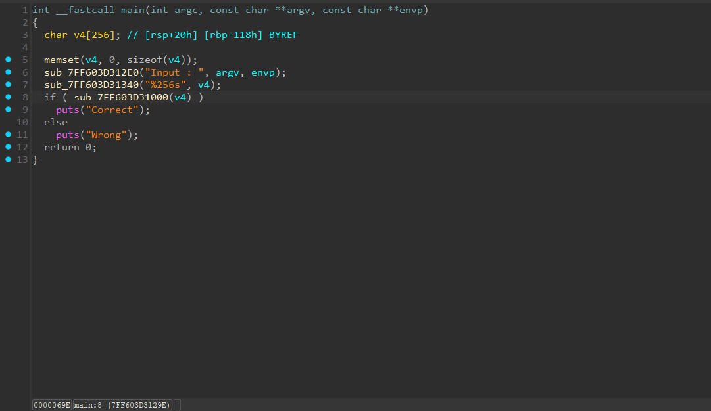
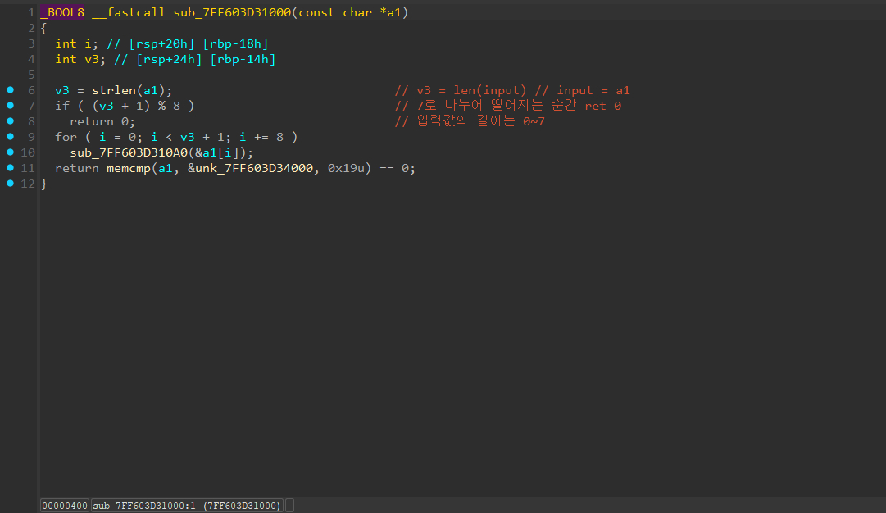
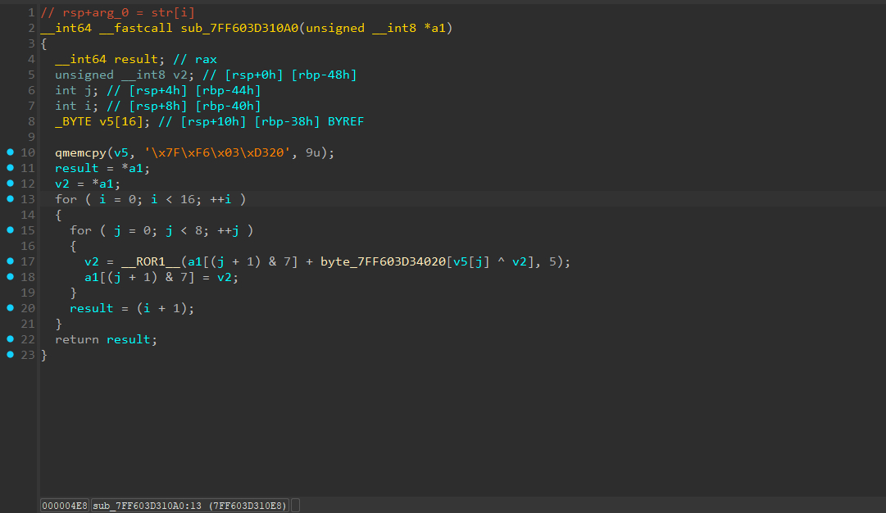
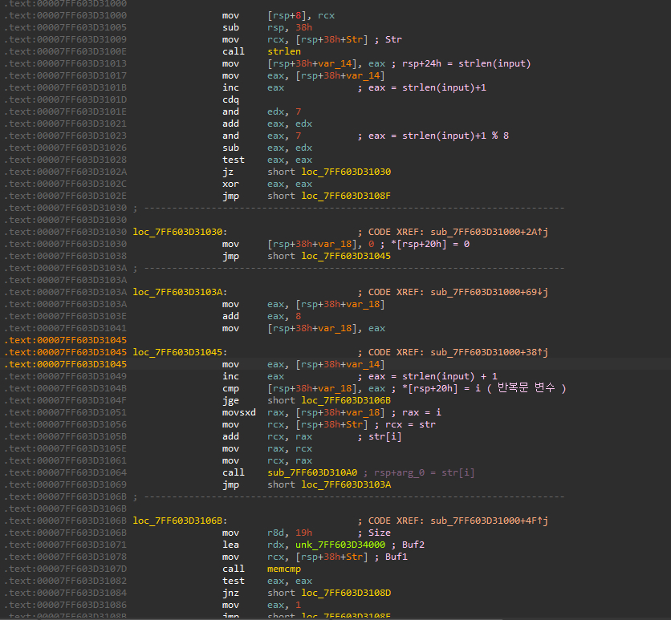
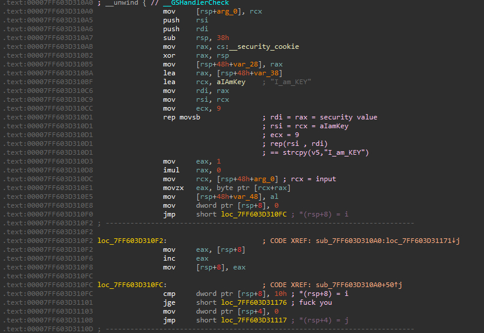
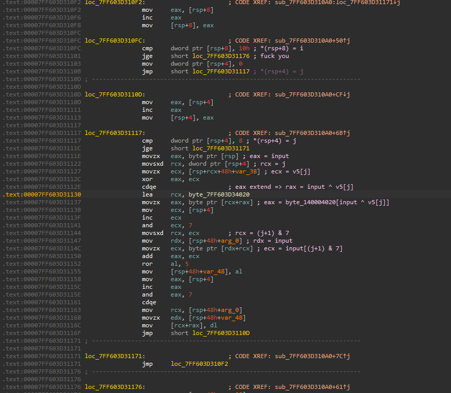
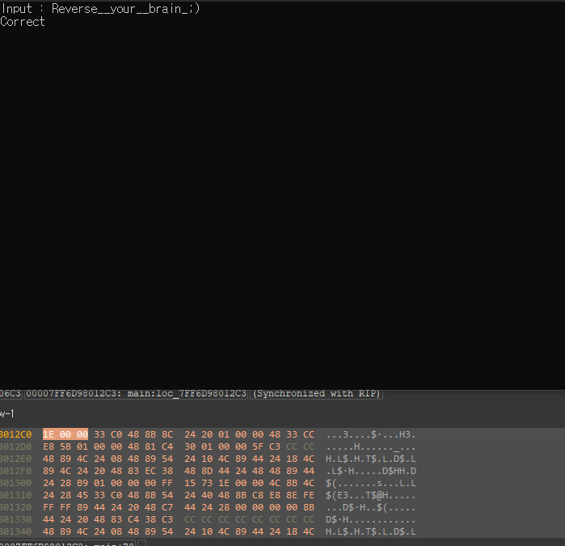

# [rev-basic-07]

## 🔍 문제 설명 / Problem Description
- 문제 출처 / Source: https://dreamhack.io/wargame/challenges/23
- 요약 / Summary:
  - 간단한 문자열 비교를 통해 플래그를 찾는 리버싱 문제입니다.  
  - This is a simple reversing challenge based on string comparison.

## 🛠 사용 도구 및 환경 / Tools & Environment
- 사용한 도구 / Tools used: IDA Free 9.1

- 분석 환경 / Analysis environment: MS Windows 10

## 🧠 의사 코드 분석 / Pseudocode Analysis  
- 실행 포맷 / Executable format: Portable executable for AMD64 (PE)

- 주요 함수 및 흐름 / Key functions & flow  
1. **Main Function**  
  
   여타 다른 rev-basic 문제와 같이 특별한 부분이 없는 입력 후 분기에 따라 출력 하는 구조이다.  
  
2. **Sub_7FF603D31000**  
  
   입력값의 길이가 7 , 15 , 23 ... 이 아니라면 조건식이 양수가 되어  
   0을 반환하고 종료 한다.  
   (주석에는 미친 소리를 적어놓았다...)  

   이후 문자열을 8개씩 끊어 sub_7FF603D310A0 함수를 호출한다.  
   아마도 암호화 과정이겠지.. 주소값을 보내는걸 보아하니 좀 더 확신이 든다  

   이후 memcmp로 unk_7FF603D34000과 25개의 문자를 비교한 후  
   일치한다면 0을 반환하여 correct 조건 분기를 true로 만든다.   
   (unk_7FF603D34000이 중요 테이블이라고 생각된다.)  
  
3. **Sub_7FF603D310A0 (Encrypt Logic)**  
  
   qmemcpy에서 v5로 옮겨가는 문자열 명은 "I_am_KEY" 인가 그랬을것이다.  
   맞는지 확인해보기 위해 실행을 했더니 바뀌어버렸다..  

   result와 v2에 입력값의 첫 주소를 주고  
   문자열 8개씩 한 묶음을 15번 반복시킨다.  
   처음의 결과에 1도 반영이 안 되는 result 변수를 보고 당황했는데  
   디버깅용 반복 확인 코드라는 느낌이 왔었다..  
   암호화 과정은 좀 복잡했었다. 회전 시프트는 이제 좀 익숙해졌는데  
   식 내부가 깨끗하지는 않다보니 분석하는 도중 많은 시간이 걸렸었다..  
   (대략 한 2~3시간...)  


## 🧠 어셈블리 분석 / Assembly Analysis  
1. **Main**  
  
   메인인데 cdq를 처음 본것 말고는 따로 특별한 부분은 없었따.  
   의사코드와 흐름 자체가 동일한 평범한 케이스  

2. **Sub_7FF603D310A0**  
  
   여기서부터 슬슬 값 추적하는게 어려웠다  
   원래 타 문제에서는 security_cookie 저게 메인에 붙어있는 공통된 검증  과정인데 logic에 포함되니까 관련 어셈블리까지 따라 붙으면서 보기가 좀  어려웠었다.  
   조금 헤맸지만 그래도 열심히 주석으로 기록하면서 따라가는 모습  

3. **Sub_7FF603D3110D (Encrypt Logic)**   
  
   문제는 여기였다.  
   의사코드에서 확인했던 result 변수때문에 문제 의도인지는 모르겠으나  
   정말 많이 위와 비교하면서 무슨 값들이 내려왔는지 생각하게 됐고  
   리버싱 기초 능력을 기를 수 있지 않았나..  
   그리고 이것도 이거고 더 큰 산이 아직 하나 남아있었다  

## 🔓 풀이 과정 / Solution Steps  
1. **입력값 추론**   
   관련 암호화 테이블들의 내용들을 따서 전부 헥스뷰로 따서 텍스트화 시켰고  
   옮겨서 역연산을 시도했었다. 문제에서는 단순히 ror로 우측  
   회전시프트만 하길래 좌측 회전시프트로 바꾸고 반복문을  
   끝에서부터 감소하는 형태로 돌렸으나 틀렸었다.    

2. **실패 이유**  
   이유가 뭔가하니 역으로 돌아가는 시점에서 8개로 끊는 단위의 끝 부분은  
   초기화가 되지않아 쓰레기 값이 복호화되어 안 됐었다.  
   그래서 정말 역연산 하는데에 시간을 많이 썼다.  
   이전과 같이 input * a mod b 마냥 다른 알고리즘을 추론하는게 아니라  
   순수하게 값 하나하나를 집어넣어서 움직임을 보거나  
   암호화 과정을 직접 구현해서 보거나 하는둥 다양한 시도를 했었다.  
3. **답안 코드**    
   그렇게 해서 나온 결과값이  
```
table = [ 0x7E , 0x7D , 0x9A , 0x8B , 0x25 , 0x2D , 0xD5 , 0x3D ,
        0x03 , 0x2B , 0x38 , 0x98 , 0x27 , 0x9F , 0x4F , 0xBC ,
        0x2A , 0x79 , 0x00 , 0x7D , 0xC4 , 0x2A , 0x4F , 0x58 ,
        0x00 ]
## unk_140004000

encrypt_table = [ 0x63 , 0x7C , 0x77 , 0x7B , 0xF2 , 0x6B , 0x6F , 0xC5 ,
                0x30 , 0x01 , 0x67 , 0x2B , 0xFE , 0xD7 , 0xAB , 0x76 ,
                0xCA , 0x82 , 0xC9 , 0x7D , 0xFA , 0x59 , 0x47 , 0xF0 ,
                0xAD , 0xD4 , 0xA2 , 0xAF , 0x9C , 0xA4 , 0x72 , 0xC0 ,
                0xB7 , 0xFD , 0x93 , 0x26 , 0x36 , 0x3F , 0xF7 , 0xCC ,
                0x34 , 0xA5 , 0xE5 , 0xF1 , 0x71 , 0xD8 , 0x31 , 0x15 ,
                0x04 , 0xC7 , 0x23 , 0xC3 , 0x18 , 0x96 , 0x05 , 0x9A ,
                0x07 , 0x12 , 0x80 , 0xE2 , 0xEB , 0x27 , 0xB2 , 0x75 ,
                0x09 , 0x83 , 0x2C , 0x1A , 0x1B , 0x6E , 0x5A , 0xA0 ,
                0x52 , 0x3B , 0xD6 , 0xB3 , 0x29 , 0xE3 , 0x2F , 0x84 ,
                0x53 , 0xD1 , 0x00 , 0xED , 0x20 , 0xFC , 0xB1 , 0x5B ,
                0x6A , 0xCB , 0xBE , 0x39 , 0x4A , 0x4C , 0x58 , 0xCF ,
                0xD0 , 0xEF , 0xAA , 0xFB , 0x43 , 0x4D , 0x33 , 0x85 ,
                0x45 , 0xF9 , 0x02 , 0x7F , 0x50 , 0x3C , 0x9F , 0xA8 ,
                0x51 , 0xA3 , 0x40 , 0x8F , 0x92 , 0x9D , 0x38 , 0xF5 ,
                0xBC , 0xB6 , 0xDA , 0x21 , 0x10 , 0xFF , 0xF3 , 0xD2 ,
                0xCD , 0x0C , 0x13 , 0xEC , 0x5F , 0x97 , 0x44 , 0x17 ,
                0xC4 , 0xA7 , 0x7E , 0x3D , 0x64 , 0x5D , 0x19 , 0x73 ,
                0x60 , 0x81 , 0x4F , 0xDC , 0x22 , 0x2A , 0x90 , 0x88 ,
                0x46 , 0xEE , 0xB8 , 0x14 , 0xDE , 0x5E , 0x0B , 0xDB ,
                0xE0 , 0x32 , 0x3A , 0x0A , 0x49 , 0x06 , 0x24 , 0x5C ,
                0xC2 , 0xD3 , 0xAC , 0x62 , 0x91 , 0x95 , 0xE4 , 0x79 ,
                0xE7 , 0xC8 , 0x37 , 0x6D , 0x8D , 0xD5 , 0x4E , 0xA9 ,
                0x6C , 0x56 , 0xF4 , 0xEA , 0x65 , 0x7A , 0xAE , 0x08 ,
                0xBA , 0x78 , 0x25 , 0x2E , 0x1C , 0xA6 , 0xB4 , 0xC6 ,
                0xE8 , 0xDD , 0x74 , 0x1F , 0x4B , 0xBD , 0x8B , 0x8A ,
                0x70 , 0x3E , 0xB5 , 0x66 , 0x48 , 0x03 , 0xF6 , 0x0E ,
                0x61 , 0x35 , 0x57 , 0xB9 , 0x86 , 0xC1 , 0x1D , 0x9E ,
                0xE1 , 0xF8 , 0x98 , 0x11 , 0x69 , 0xD9 , 0x8E , 0x94 ,
                0x9B , 0x1E , 0x87 , 0xE9 , 0xCE , 0x55 , 0x28 , 0xDF ,
                0x8C , 0xA1 , 0x89 , 0x0D , 0xBF , 0xE6 , 0x42 , 0x68 ,
                0x41 , 0x99 , 0x2D , 0x0F , 0xB0 , 0x54 , 0xBB , 0x16 ]
## byte_140004020

encrypt_table2 = "I_am_KEY".encode()
## strcpy(v5 , "I_am_KEY") 즉 v5


def rol(value,count,bits=8):
  return ((value << count | value >> (bits-count))) & ((1 << bits) - 1)
## 좌로 회전 시프트

result = [] * (len(table)+1)
## 복호화 결과를 받을 변수

a1 = table[0:8]
for i in range(15,-1,-1):
  for j in range(7,-1,-1):
    v2 = a1[(j+1)&7] & 0xFF
    a1[(j+1)&7] = (rol(v2,5)-encrypt_table[encrypt_table2[j]^a1[j]]) & 0xFF

for i in a1:
  result += chr(i)

a1 = table[8:16]
for i in range(15,-1,-1):
  for j in range(7,-1,-1):
    v2 = a1[(j+1)&7] & 0xFF
    a1[(j+1)&7] = (rol(v2,5)-encrypt_table[encrypt_table2[j]^a1[j]]) & 0xFF

for i in a1:
  result += chr(i)

a1 = table[16:24]
for i in range(15,-1,-1):
  for j in range(7,-1,-1):
    v2 = a1[(j+1)&7] & 0xFF
    a1[(j+1)&7] = (rol(v2,5)-encrypt_table[encrypt_table2[j]^a1[j]]) & 0xFF

for i in a1:
  result += chr(i)

print("DH{"+''.join(result)+"}")
```  
   이거 였다.  대입도 전부 역으로 하고  
   ror내부의 식을 밖으로 꺼내는 법도 고민해보고  
   시도하는 과정은 좀 괴로웠으나 결과값을 보니 좋았다  

## ✅ 결과 / Result
-   

   (KR) 그래서 결과값은 성공!  
   (EN) Success!  

## 📝 기타 메모 / Notes
- (KR) 분석 중 삽질하거나 기록해두고 싶은 것들  
- (EN) Extra notes, pitfalls, or things to remember later

1. 역 연산 많이 연습하자ㅏ...
