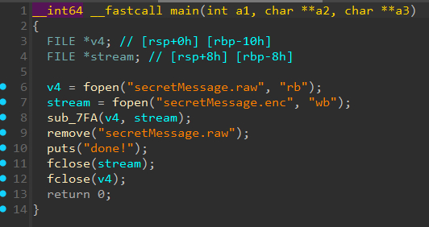
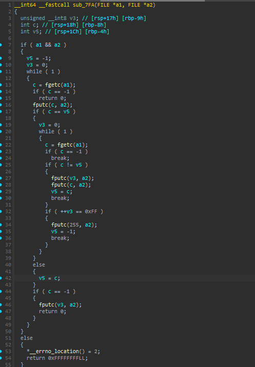
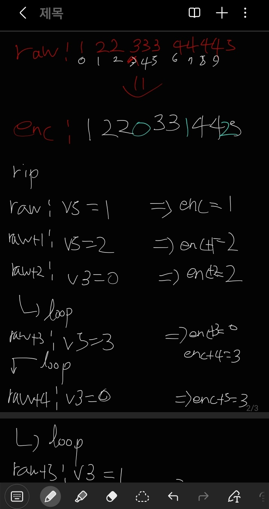
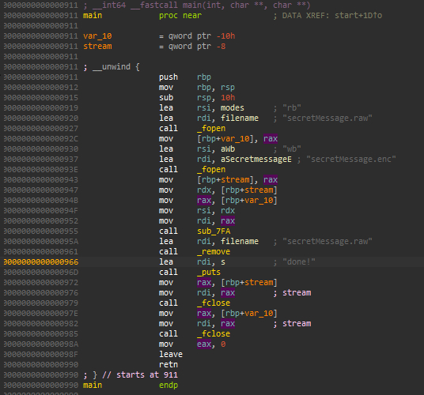
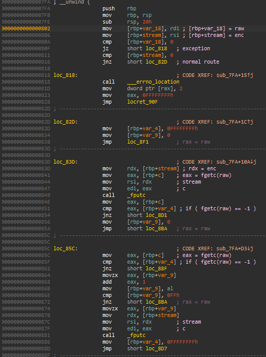
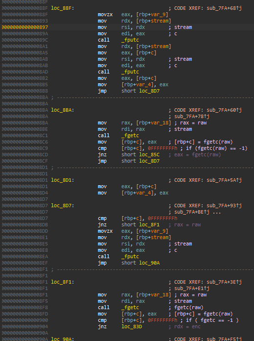

# [secret message]  

## 🔍 문제 설명 / Problem Description
- 문제 출처 / Source: https://dreamhack.io/wargame/challenges/235  
- 요약 / Summary:  
  - 이미지 인코딩 로직을 역연산 하여 .raw를 복원하는 문제입니다.  

## 🛠 사용 도구 및 환경 / Tools & Environment  
- 사용한 도구 / Tools used: IDA Free 9.1  
- 분석 환경 / Analysis environment: MS Windows 10  
- 실행 포맷 / Executable format: ELF64 for x86-64 (Shared Object)  

## 🧠 의사 코드 분석 / Pseudocode Analysis  
1. **Main Function**  
  
   .raw를 읽는 스트림과 .enc를 쓰는 스트림을 생성 후  
   sub_7FA 를 통해 인코딩 되는 형태의 프로그램이다.  
   이러면 당연히 메인 로직은 sub_7FA 에 있을 수 밖에 없다.  

2. **sub_7FA**  
  
   첫번째 분기에서 else는 파일이 없을때를 대비한 평범한 예외처리로 보이고  

   .raw 에서 한 문자를 읽고 .enc 에 한 문자를 쓰는게 평범한 형태 인것으로 보이나  

   내부 루프가 하나가 더 있다. 이전에 읽은 문자를 기록하는 변수 v5 ,  
   반복 횟수를 기록하는 v3 흐름을 알아보기 위해 수기로 흐름을 작성했다.  

   
   같은 문자가 2번이상 반복할 경우 추가 반복되는 문자의 수를 기록하는 형태였다.  


## 🧠 어셈블리 분석 / Assembly Analysis  
1. **Main**     
  

2. **sub_7FA**    
   (1)  
     

   (2)  
     

   혹시 몰라서 어셈블리를 확인 해보았으나 의사코드와 크게 엇나가는
   점이 없었다.  

## 🔓 풀이 과정 / Solution Steps  
1. **입력값 추론**      
   X  
2. **실패 이유**  
   X  
3. **답안 코드**    
```  
import io

def decode(a1,a2):
    v5 = -1
    while(1):
        c = a1.read(1)
        if not c :
            break ## EOF 만나면 1차 루프 종료
        a2.write(c)

        if(c == v5):
            while(1):
                c = a1.read(1)
                if not c :
                    break ## EOF 만나면 2차 루프 종료

                if (c != v5):
                    v3 = int.from_bytes(c) ## 3차 루프 횟수 저장
                    for i in range(v3):
                        a2.write(v5)
                    break
        else:
            v5 = c

if __name__ == '__main__':
    with open('secretMessage.raw','wb') as raw, open('secretMessage.enc','rb') as enc:
        decode(enc,raw) ## .raw 랑 .enc 스트림 생성 후 decode 함수 실행
```  
   인코딩과 크게 다를 것은 없었지만 반복이 된다면 횟수가 나오니  
   내부 루프를 한번 더 돌려서 추가로 적어주면 되는거였다.  
   이렇게 복호화 한 .raw 파일을  


## ✅ 결과 / Result
-  
```  
python imageviewer.py secretMessage.raw  
```  
   주어진 이미지 뷰어를 통해 이미지를 열어준다면 플래그를 획득할 수 있다.  

## 📝 기타 메모 / Notes
- (KR) 분석 중 삽질하거나 기록해두고 싶은 것들  
- (EN) Extra notes, pitfalls, or things to remember later

